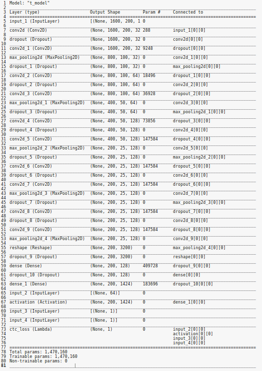

# ASRT-SR-tensorflow2.0
基于深度学习识别THCHS30数据集（refer to [ASRT_SpeechRecognition](https://github.com/nl8590687/ASRT_SpeechRecognition) [AI柠檬](https://blog.ailemon.me/2018/08/29/asrt-a-chinese-speech-recognition-system/)）

# 加载数据
产生数据目录和标签的csv文件
 
	python3 prepare_data.py 

**train.csv**

wav_filename     CHS_transcript      Pinyin_transcript  
1. ... /ASRT_SR_tensorflow2.0/data/data_thchs30/train/A2_0.wav  绿是阳春烟景大块文章的底色四月的林峦更是绿得鲜活秀媚诗意盎然	lv4 shi4 yang2 chun1 yan1 jing3 da4 kuai4 wen2 zhang1 de5 di3 se4 si4 yue4 de5 lin2 luan2 geng4 shi4 lv4 de5 xian1 huo2 xiu4 mei4 shi1 yi4 ang4 ran2
2. ... /ASRT_SR_tensorflow2.0/data/data_thchs30/train/A2_15.wav	柳宗夏现年六十岁五十年代进入韩外务部工作一九九四年十二月任外交安保首席秘书	liu3 zong1 xia4 xian4 nian2 liu4 shi2 sui4 wu3 shi2 nian2 dai4 jin4 ru4 han2 wai4 wu4 bu4 gong1 zuo4 yi1 jiu3 jiu3 si4 nian2 shi2 er4 yue4 ren4 wai4 jiao1 an1 bao3 shou3 xi2 mi4 shu1
3. ... /ASRT_SR_tensorflow2.0/data/data_thchs30/train/A2_26.wav	等从晕晕乎乎中醒转来时间已经丢下一串长长的脚印消逝得无影无踪	deng3 cong2 yun1 yun5 hu1 hu1 zhong1 xing3 zhuan3 lai2 shi2 jian1 yi3 jing1 diu1 xia4 yi2 chuan4 chang2 chang2 de5 jiao3 yin4 xiao1 shi4 de5 wu2 ying3 wu2 zong1  

**dev.csv**  
...   

**test.csv**  
...  

SpeechDataset.py generate_data()函数得到  (B, 1600, 200, 1)  (B, 64) 的数据和标签

# 特征提取
提取wav的语谱图特征 (eg. A2_33.wav)

# 深度架构

# 训练声学模型
	
	python3 SpeechModel.py    或者
	bash run.sh
	
流程如下：
    
    root = '/raid/BH/mitom/data/data_thchs30'
     
    # 数据预处理，将data-label输出到cvs文件
    SUBSETS = ["train", "dev", "test"]
    for SUBSET in SUBSETS:
        processor(root, SUBSET, True, root)
    
    # init model
    model = SpeechModel(root)
     
    # train
    model.train_speech(epoch=70, step_per_epochs=640, batch_size=16, path='model_speech/train/',modelfile='weight.ckpt')  
    
70epoch训练结果日志：
2020-04-16 21:44:39

epoch:  0
Train for 640 steps

  1/640 [..............................] - ETA: 2:58:20 - loss: 725.1706  
  2/640 [..............................] - ETA: 1:30:23 - loss: 660.8561  
  3/640 [..............................] - ETA: 1:01:02 - loss: 539.7244  
  4/640 [..............................] - ETA: 46:13 - loss: 493.3954    
  5/640 [..............................] - ETA: 37:25 - loss: 453.6105  
  6/640 [..............................] - ETA: 31:28 - loss: 424.4420  
  ...  
  ...  
  
634/640 [============================>.] - ETA: 2s - loss: 36.1764  
635/640 [============================>.] - ETA: 1s - loss: 36.1792  
636/640 [============================>.] - ETA: 1s - loss: 36.1763  
637/640 [============================>.] - ETA: 1s - loss: 36.1718  
638/640 [============================>.] - ETA: 0s - loss: 36.1719  
639/640 [============================>.] - ETA: 0s - loss: 36.1677  
640/640 [==============================] - 255s 398ms/step - loss: 36.1670  
save model file successful,  model_speech/train/weight.ckpt  
***train: error_word_rate:  0.1655813953488372***  
***test: error_word_rate:  0.3559650824442289***  
2020-04-17 02:46:03  

   

# 测试声学模型

    # wav test
    model = SpeechModel('')
    model.load_model('model_speech/train/weight.ckpt')
    model.recognize_speech("./data/A2_0.wav")  

pred:     
['lv4', 'shi4', 'yang2', 'chun1', 'yan1', 'jing3', 'da4', 'kuai4', 'wen2', 'rang4', 'de5', 'di3', 'se4', 'si4', 'yu4', 'de5', 'ling2', 'luan2', 'ge4', 'shi4', 'lv4', 'de5', 'xian1', 'huo2', 'xiu4', 'wu3', 'mei4', 'shi1', 'yi4', 'ang4', 'ran2']  
label:  
lv4 shi4 yang2 chun1 yan1 jing3 da4 kuai4 wen2 zhang1 de5 di3 se4 si4 yue4 de5 lin2 luan2 geng4 shi4 lv4 de5 xian1 huo2 xiu4 mei4 shi1 yi4 ang4 ran2  
绿 是 阳春 烟 景 大块 文章 的 底色 四月 的 林 峦 更是 绿 得 鲜活 秀媚 诗意 盎然

    
# 语言模型
	lm = LanguageModel('model_language/')
    lm.load_model()
    list_pinyin = ['kao3','yan2', 'ying1', 'yu3']
    list_pinyin = ['hong2','lei2', 'ba1', 'lei2']
    list_pinyin = ['zhong1','guo2', 'ren2', 'min2']
    list_pinyin = ['cai4', 'zuo4', 'hao3', 'le5', 
    			'yi4', 'wan3', 'qing1', 'zheng1', 'wu3', 'chang1', 'yu2', 
                'yi4', 'wan3', 'fan1', 'qie2', 'chao3', 'ji1', 'dan4',
                'yi4', 'wan3', 'zha4', 'cai4', 'gan1', 'zi4', 'chao3', 'rou4', 'si1']
    result = lm.speech2text(list_pinyin)
    print(result)

pred & label  
菜做好了一碗清正武昌鱼一晚翻茄炒鸡蛋一晚咋采干字炒肉丝  
菜做好了一碗清蒸武昌鱼一碗蕃茄炒鸡蛋一碗榨菜干子炒肉丝  

# 测试
	python3 test.py

	from SpeechModel import SpeechModel
	from LanguageModel import LanguageModel
	
	# 声学模型
	model = SpeechModel('')
	model.load_model('model_speech/train/weight.ckpt')
	result_pinyin = model.recognize_speech("./data/data_thchs30/data/A2_3.wav")
	
	# 语言模型
	lm = LanguageModel('model_language/')
	lm.load_model()
	result_chs = lm.speech2text(result_pinyin)
	print(result_chs)

['cai4', 'zuo4', 'hao3', 'le5', 'yi4', 'wan3', 'qing1', 'zheng1', 'wu3', 'chang1', 'yu2', 'yi4', 'wan3', 'fan1', 'qie2', 'chou3', 'ji1', 'dai4', 'yi4', 'wan3', 'zha4', 'cai4', 'gan1', 'zi4', 'chao3', 'lu4', 'si1']  
菜做好了一碗清正武昌鱼一晚翻茄丑期待一晚咋采干字炒绿思  

# 总结
声学模型和语言模型性能需改善
	

